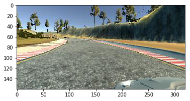
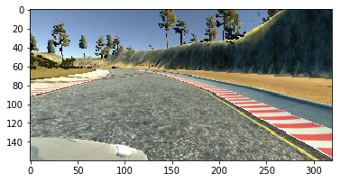
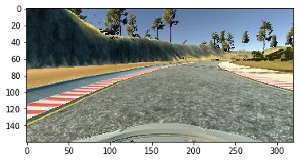
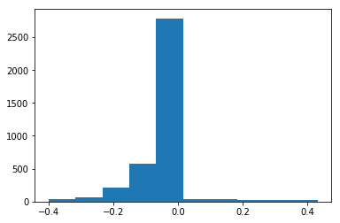
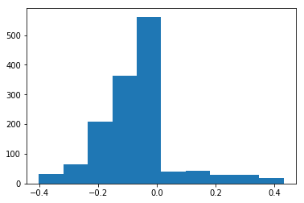
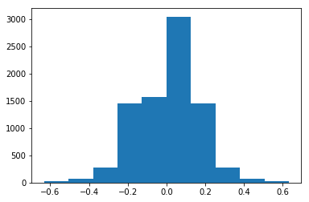
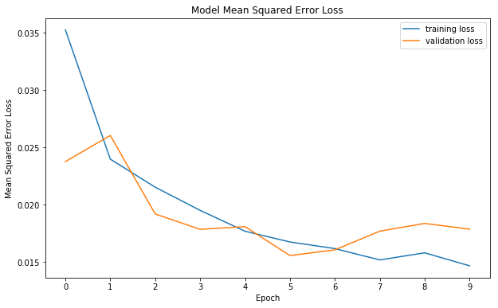

## Behavioral Cloning

My project includes the following files:
* model.py containing the script to create and train the model
* drive.py for driving the car in autonomous mode
* model.h5 containing a trained convolution neural network 
* writeup_report.md summarizing the results

### 1. Model Architecture

I am using Nvidia model as explained in the lecture. The model reference can be found here:  
https://devblogs.nvidia.com/parallelforall/deep-learning-self-driving-cars/  
Please see the next section for details.

### 2. Attempts to reduce overfitting in the model

In addition to the original model, I have added Dropout layers with keep probability of 0.5 on all fully connected layers.  
The model was tested by running it through the simulator and ensuring that the vehicle could stay on the track.

### 3. Model parameter tuning

The model used an adam optimizer, so the learning rate was not tuned manually.

### 4. Appropriate training data

Training data was chosen to keep the vehicle driving on the road.  
I collected different sets of data using the provided simulator.  I used a combination of smooth enter lane driving, and recovering from the left and right sides of the road.  
However, the best performing model comes from the smooth driving data utilizing multiple cameras with left and right steering angle correction of +/- 0.2.  
For details about how I created the training data, see the next section. 

### Model Architecture and Training Strategy

#### 1. Solution Design Approach

The overall strategy for deriving a model architecture was to tried different models and using different data sets.
The models that I have tried for this project:
1. Simple Neural Networks. The resulting model is bad. The car just drives around in counter clockwise  
2. LeNet, as described in the lecture. The car failed to drive by itself for a lap.  
3. Nvidia model, without dropouts. Good result. The car was able to drive autonomously on track for hours with the resulting model.  
4. Nvidia model, with dropouts. Better generic result. The car was able to drive autonomously on track for hours with the resulting model. It was not as smooth as the resulting model from \#3, but with more parameter tuning this might be a more generalized model.  

The best performing model was created using a smooth 4 laps driving data, with multiple cameras and discarding about 75% of data with steering angle that falls within -0.1 and 0.0

#### 2. Final Model Architecture

The final model architecture is the Nvidia model as explained in the lecture.  The model reference can be found here:
https://devblogs.nvidia.com/parallelforall/deep-learning-self-driving-cars/  
In addition to the original model, I have added Dropout layers with keep probability of 0.5 on all fully connected layers.  
The model consists of 5 convolutional layers and 3 fully connected layers.  
Convolutional Layer 1: Filter: 24 x (5 x 5), Stride: 2 x 2, RELU activation  
Convolutional Layer 2: Filter: 36 x (5 x 5), Stride: 2 x 2, RELU activation  
Convolutional Layer 3: Filter: 48 x (5 x 5), Stride: 2 x 2, RELU activation  
Convolutional Layer 4: Filter: 64 x (3 x 3), Stride: 1 x 1, RELU activation  
Convolutional Layer 5: Filter: 64 x (3 x 3), Stride: 1 x 1, RELU activation  
Fully Connected Layer 1: Output 100 neurons with Dropout layer (keep probability: 0.5)  
Fully Connected Layer 2: Output  50 neurons with Dropout layer (keep probability: 0.5)  
Fully Connected Layer 3: Output  10 neurons with Dropout layer (keep probability: 0.5)  
Final Layer: Output 1  

Here is a visualization of the architecture:

#### 3. Creation of the Training Set & Training Process

To capture good driving behavior, I collected different sets of data using the provided simulator. I used a combination of smooth center lane driving, and recovering from the left and right sides of the road.
However, the best performing model comes from just the smooth driving data for 4 laps, utilizing multiple cameras with left and right steering angle correction of +/- 0.2

Here is an example image of center lane driving:

Center Camera:

Left Camera:

Right Camera:

#### 4. Data augmentation

To augment the data sat, I also flipped images and angles thinking that this would reduce left turn bias because I only collected the data from driving the track in one direction. 

For example, here is an image that has then been flipped:

Original:

  

Flipped:

The resulting data is also heavily bias towards data with steering angle falls between -0.1 and 0.0. 
Here is the histogram of the original data:

Before training the model, I discard about 75% of this data to reduce the low angle bias.
Here is the histogram of the reduced data:

Here is the histogram of the final data (after augmentation):

#### 5. Splitting data for training/evaluation

The training/evaluation set split is 80%/20%

#### 6. Training/Validation Loss History Plot

Loss plot:

The validation loss is the smallest at epoch 6. 
